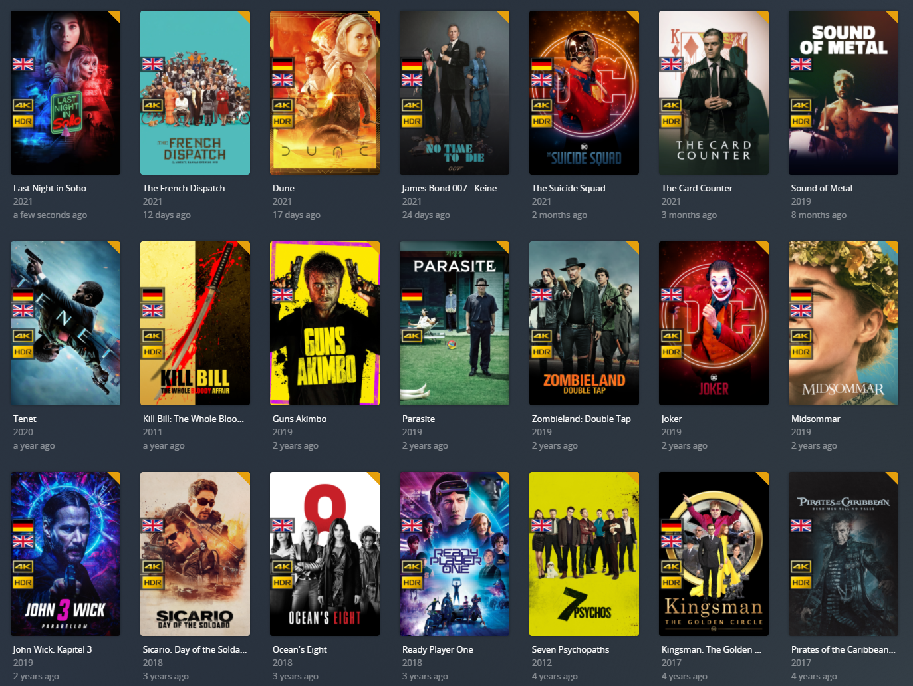

# Cpt Kuesels Language Overlays
I am using a software called Plex-Meta-Manager, located here (https://github.com/meisnate12/Plex-Meta-Manager), to apply language specific overlays to media items in Plex.

If you have questions or want to chat about the overlays you can find me on the PMM Discord (https://discord.gg/NfH6mGFuAB).

You will find all my overlay files and my metadata files to use them with PMM in this repository.

If you want to use additional languages not yet present, please open an issue here.

For now I provide single language and dual language overlays, as they cover my needs. I am open to provide additional variants for more languages, please also open an issue if you want me to add something.

Disclaimers:
I use flags from the website: https://www.countries-ofthe-world.com/flags-of-the-world.html
This is the image I used to create the 4k/HDR icons for my overlay: https://currys-ssl.cdn.dixons.com/css/themes/sony_2018/4k_hdr/images/bravia-logo-4khdr.png

My overlays v2 in action:
